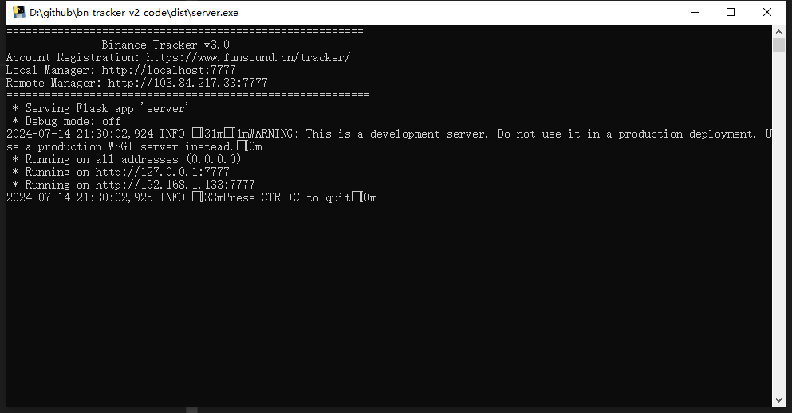
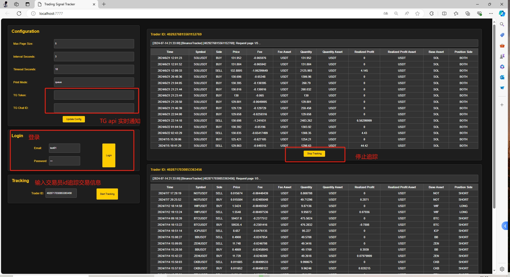
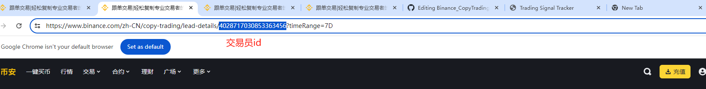

# Binance_CopyTrading_Assistant_V3_Tracker
# 币安交易信号追踪器

后台追踪，网页后台管理

XT交易所注册链接（高额返佣奖励）：https://www.xt.com/zh-CN/accounts/register?ref=RJKFGL

## Step 1
账号注册：
~~https://www.funsound.cn/tracker~~
无需登录，免费开放

软件下载：
https://github.com/lazyer-trading/Binance_CopyTrading_Assistant_V3_Tracker/releases

## Step 2
运行软件，支持windows/linux, 建议服务器长期运行

[windows]

[linux]

后台运行： nohup ./tracker_server > run.log 2>&1 &

关闭后台: ps -ef | grep ./tracker_server | awk '{print $2}' | xargs kill -9

## Step 3
打开后台管理
> 本地管理：http://localhost:7777

> 远程管理：http://{server_ip}:7777 (可以部署在linux服务器)

获取交易员id

关闭网页不影响后台运行

# 联系我们
#### Telegram: [@lazyer_trading](https://t.me/bn_ct_track)
#### Email: [lazyer.trading@gmail.com](mailto:lazyer.trading@gmail.com)
